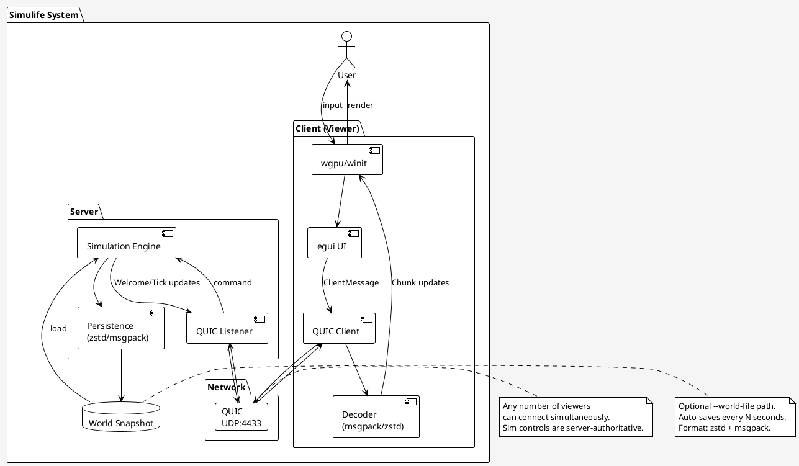
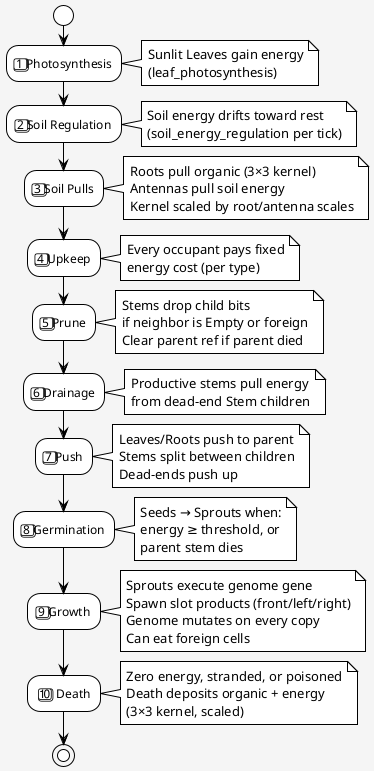
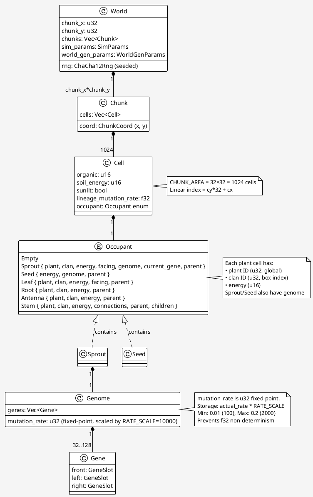
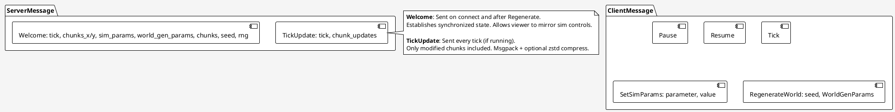

∂# Architecture Overview

Simulife-rs is a distributed plant-evolution cellular automaton with a Rust server engine and networked wgpu/egui viewer clients connected via QUIC.

## System Architecture



## Simulation Pipeline

Each tick runs **10 phases in sequence** to update world state deterministically:



## Data Model: Chunks and Cells

The world is divided into **chunks** (32×32 cells each, in row-major order). Each cell contains:



## Determinism Architecture

Determinism is guaranteed by:

```plantuml
@startuml determinism-arch
!theme plain
skinparam backgroundColor #f5f5f5
skinparam fontSize 10

package "Determinism Guarantees" {
  component "Seeded ChaCha12Rng" as rng
  note right of rng
    All randomness from seeded RNG
    Same seed → identical sequence
  end note

  component "Fixed-Point Arithmetic" as fixedpt
  note right of fixedpt
    mutation_rate: u32 (not f32)
    Avoids floating-point rounding
    Conversion to f32 only for display
  end note

  component "BTreeMap/BTreeSet\n(not HashMap/HashSet)" as btree
  note right of btree
    Ordered iteration in growth-bid resolution
    HashMap randomizes iteration order
    Caused divergence in earlier bug
  end note

  component "Immutable WorldGenParams\nafter world-gen" as immutable
  note right of immutable
    world_wrap can't change at runtime
    Prevents accidental topology shifts
    Part of world snapshot
  end note

  component "Determinism Test CLI\n(--determinism-test seed:ticks)" as test_cli
  note right of test_cli
    Rebuilds world, runs N ticks
    Compares state hashes across runs
    Easy verification tool
  end note
}

note bottom
  Each change can affect state hash but not break determinism.
  Same seed → identical hash at every tick across restarts.
  Different seeds → different outcomes, still deterministic.
end note
@enduml
```



## Network Protocol

Client and server exchange **binary** messages (msgpack + optional zstd compression):



## Codebase Structure

```
crates/
├── protocol/          # Wire types + codecs (no async, no GPU)
│   ├── Cell, Chunk, Occupant, Genome
│   ├── SimParams, WorldGenParams
│   ├── ClientMessage, ServerMessage
│   └── msgpack/zstd roundtrip tests
│
├── server/            # Simulation + QUIC listener + persistence
│   ├── main.rs        # Entry point, CLI args, QUIC setup
│   ├── sim.rs         # 10 phases, mutate_world(), BTreeMap for determinism
│   ├── world.rs       # World generation, sprout placement
│   ├── persist.rs     # Save/load snapshots (zstd + msgpack)
│   └── tests/         # Unit tests for each phase + determinism
│
└── viewer/            # wgpu/winit/egui client
    ├── main.rs        # Entry point, window setup
    ├── app.rs         # State management, camera, dialogs
    ├── render.rs      # egui UI, chunk upload, frame render
    ├── net.rs         # QUIC connect/read/send
    └── tests/         # Camera math, label formatting
```

## Key Design Decisions

### 1. **Determinism-First Simulation**
- Fixed-point mutation rates (u32, not f32) to avoid floating-point non-determinism
- ChaCha12Rng (seeded) for all randomness
- BTreeMap for ordered iteration in growth-bid resolution
- Immutable WorldGenParams after world generation
- Verified with `--determinism-test` CLI flag

### 2. **Chunked World**
- 32×32 cell chunks for efficient storage and network transfer
- Row-major layout (chunk_idx = cy * chunks_x + cx)
- Only modified chunks sent to viewers each tick
- Scales to large worlds (default: 36×24 chunks = 864 chunks = 884,736 cells)

### 3. **Live Tuning vs. Immutable Settings**
- **SimParams** (live): Energy flows, costs, scales — take effect next tick
- **WorldGenParams** (immutable): World size, topology (world_wrap), spacing — require regeneration
- Both persisted in snapshot and mirrored in viewer UI

### 4. **Persistence**
- zstd-compressed msgpack snapshots with version field
- .bak rotation keeps previous good copy
- Auto-save every N seconds (configurable)
- Forward-compatible via `#[serde(default)]`

### 5. **Multi-Client Architecture**
- Server-authoritative: all sim controls flow through server
- Viewers mirror UI state via Welcome broadcasts
- Any viewer can pause/resume, change params, or regenerate world
- All viewers see the same world state (eventually consistent via tick updates)

### 6. **Platform Support**
- Desktop: wgpu/winit + egui (macOS, Linux, Windows)
- Android: wgpu/ndk + egui compiled as cdylib
- Server: x86_64 Linux + Docker support

## Performance Characteristics

- **Per-tick cost**: O(world_size) — linear scan of all cells for each phase
- **Network bandwidth**: Only modified chunks (msgpack + optional zstd)
- **Memory**: ~75 MB Docker image (multi-stage build), ~500 MB world state for default size
- **Simulation rate**: Tunable via `--tick-hz` (default: 10 Hz)

## Profiling & Observability

- Chrome-trace JSON output (`--trace-chrome <path>`)
- Per-phase events with occupant counts
- Per-tick viewer metrics (network decode, upload, total µs)
- Graceful shutdown after N seconds (`--profile-duration-secs <n>`)
- Trace summarization: `scripts/analyze-trace.sh <trace.json>`
